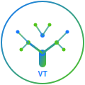
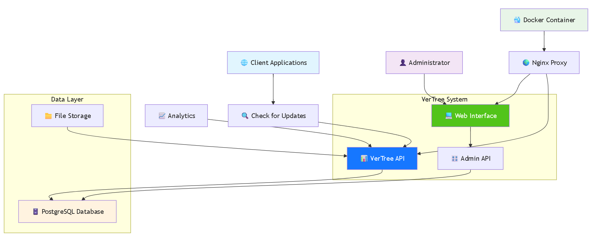

# VerTree 🌳

<div align="center">



**A lightweight and intuitive version control system with a tree-structured history**

[](https://opensource.org/licenses/Apache-2.0)
[](https://golang.org/)
[](https://vuejs.org/)
[](https://www.docker.com/)
[](https://github.com/Run-Panel/VerTree/stargazers)

[🐛 **Report Bug**](https://github.com/Run-Panel/VerTree/issues) • [💡 **Request Feature**](https://github.com/Run-Panel/VerTree/issues)

</div>

---

## ✨ Features

- 🌳 **Tree-structured History** - Visualize version relationships as an intuitive tree
- 🚀 **Modern Web UI** - Beautiful Vue.js 3 interface with Element Plus components
- 🔄 **Version Management** - Create, publish, and manage software versions effortlessly
- 📊 **Analytics Dashboard** - Track version adoption and usage statistics
- 🌍 **Multi-channel Support** - Manage different release channels (stable, beta, alpha)
- 🔒 **Secure & Scalable** - Built with Go backend and PostgreSQL database
- 🐳 **Docker Ready** - Easy deployment with Docker and Docker Compose
- 🌐 **Internationalization** - Support for multiple languages (English, Chinese)
- 📱 **Responsive Design** - Works perfectly on desktop and mobile devices
- ⚡ **RESTful API** - Well-documented API for integration

## 🎯 Use Cases

- **Software Distribution** - Manage and distribute software updates
- **Enterprise Applications** - Control internal application versions
- **Mobile App Updates** - Handle iOS/Android app version management
- **Game Development** - Manage game patches and updates
- **IoT Firmware** - Distribute firmware updates to devices
- **Documentation Versioning** - Track documentation versions

## 📸 Screenshots

<div align="center">
  
  
</div>

## 🚀 Quick Start

### Prerequisites

- Go 1.21 or later
- Node.js 18 or later
- PostgreSQL (for production) or SQLite (for development)
- Docker & Docker Compose (optional)

### 1. Clone the Repository

```bash
git clone https://github.com/Run-Panel/VerTree.git
cd VerTree
```

### 2. Environment Setup

```bash
# Copy environment file
cp env.example .env

# Edit the .env file with your configurations
nano .env
```

### 3. Install Dependencies

```bash
# Backend dependencies
go mod tidy

# Frontend dependencies
cd frontend
npm install
cd ..
```

### 4. Build and Run

```bash
# Build frontend
make frontend

# Run the application
make dev
```

### 5. Access the Application

- 🌐 **Web Interface**: http://localhost:8080/admin
- 🔗 **API Endpoint**: http://localhost:8080/api/v1
- ❤️ **Health Check**: http://localhost:8080/health

### 🐳 Docker Deployment

#### Development Environment

```bash
make docker-dev
```

#### Production Environment

```bash
# Set environment variables
export REGION=global
export DOMAIN=your-domain.com

# Deploy
make docker
```

## 🏗️ Architecture

### Tech Stack

| Component | Technology | Description |
|-----------|------------|-------------|
| **Backend** | Go + Gin | RESTful API server |
| **Frontend** | Vue.js 3 + Element Plus | Modern web interface |
| **Database** | PostgreSQL / SQLite | Data persistence |
| **Caching** | Redis | Performance optimization |
| **Deployment** | Docker + Nginx | Containerized deployment |

### System Architecture

<div align="center">
  
</div>

## 📊 API Documentation

### Version Management

| Method | Endpoint | Description |
|--------|----------|-------------|
| `GET` | `/api/v1/versions` | List all versions |
| `POST` | `/api/v1/versions` | Create new version |
| `GET` | `/api/v1/versions/{id}` | Get version details |
| `PUT` | `/api/v1/versions/{id}` | Update version |
| `DELETE` | `/api/v1/versions/{id}` | Delete version |
| `POST` | `/api/v1/versions/{id}/publish` | Publish version |

### Channel Management

| Method | Endpoint | Description |
|--------|----------|-------------|
| `GET` | `/api/v1/channels` | List all channels |
| `POST` | `/api/v1/channels` | Create new channel |
| `PUT` | `/api/v1/channels/{id}` | Update channel |
| `DELETE` | `/api/v1/channels/{id}` | Delete channel |

### Client API

| Method | Endpoint | Description |
|--------|----------|-------------|
| `POST` | `/api/v1/check-update` | Check for updates |
| `POST` | `/api/v1/download-started` | Record download start |
| `POST` | `/api/v1/install-result` | Record installation result |

## 🛠️ Development

### Project Structure

```
VerTree/
├── cmd/server/          # Application entry point
├── internal/            # Private application code
│   ├── config/         # Configuration management
│   ├── database/       # Database connections
│   ├── handlers/       # HTTP handlers
│   ├── models/         # Data models
│   ├── services/       # Business logic
│   └── middleware/     # HTTP middleware
├── frontend/           # Vue.js frontend application
├── web/               # Built frontend assets
├── docs/              # Documentation
└── migrations/        # Database migrations
```

### Available Commands

```bash
# Development
make dev          # Run in development mode
make build        # Build the application
make frontend     # Build frontend assets
make test         # Run tests

# Docker
make docker       # Production deployment
make docker-dev   # Development deployment
make docker-stop  # Stop services

# Maintenance
make logs         # View production logs
make logs-dev     # View development logs
make clean        # Clean build artifacts
```

### Contributing

We welcome contributions! Please see our [Contributing Guide](CONTRIBUTING.md) for details.

1. Fork the repository
2. Create your feature branch (`git checkout -b feature/amazing-feature`)
3. Commit your changes (`git commit -m 'Add some amazing feature'`)
4. Push to the branch (`git push origin feature/amazing-feature`)
5. Open a Pull Request

## 🚦 Roadmap

- [ ] **v1.1.0** - Advanced analytics and reporting
- [ ] **v1.2.0** - Plugin system for extensibility
- [ ] **v1.3.0** - Built-in CDN integration
- [ ] **v1.4.0** - Advanced deployment strategies
- [ ] **v1.5.0** - Mobile application for management

## 📝 License

This project is licensed under the Apache License 2.0 - see the [LICENSE](LICENSE) file for details.

## 🤝 Support & Community

- 🐛 **Bug Reports**: [GitHub Issues](https://github.com/Run-Panel/VerTree/issues)
- 💡 **Feature Requests**: [GitHub Discussions](https://github.com/Run-Panel/VerTree/discussions)
- 📖 **Documentation**: Check our [Wiki](https://github.com/Run-Panel/VerTree/wiki)
- 🔒 **Security Issues**: Please email security@example.com

## 📋 Project Status

- ✅ **Core Features**: Stable and production-ready
- 🔄 **Active Development**: Regular updates and improvements
- 🌟 **Community**: Welcoming contributors and feedback
- 📊 **Testing**: Comprehensive test coverage

## 🌟 Acknowledgments

- Thanks to all contributors who helped build VerTree
- Inspired by modern DevOps practices and CI/CD workflows
- Built with ❤️ by the Run-Panel team

---

<div align="center">

**⭐ If you like VerTree, please give us a star! ⭐**

[](https://github.com/Run-Panel/VerTree/stargazers)

</div>